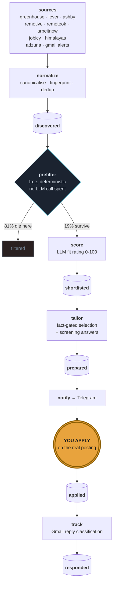

<div align="center">

# jobpipe

**A job-search pipeline that automates everything except the submit button.**

Discovery, deduplication, fit scoring, resume tailoring, screening answers and
reply tracking all run unattended.
You apply, on the employer's own site, from a queue of fifteen.

[](https://github.com/Asit0007/JobPipe/actions/workflows/tests.yml)
[](https://www.python.org/)
[](LICENSE)
[](#cost)

</div>

---

## The one rule

> **Nothing in this codebase submits an application, logs into a job board,
> drives a browser session, or stores a job-board password.**

That is a deliberate design constraint, not an unfinished feature.

Tools that drive your logged-in LinkedIn or Naukri session are the ones that get
accounts restricted — verification email, then outreach disabled for weeks, then
sometimes a lockout that never gets reversed. The asymmetry is the whole
argument: losing your LinkedIn account mid-search is the worst outcome
available, and auto-submit buys throughput on Easy Apply, the lowest-conversion
channel there is.

jobpipe works one layer down, on the **postings**. Public ATS APIs, an
aggregator, and job-alert emails **you** configured, read out of **your own**
inbox. There is no activity on any job board, so there is nothing to detect and
nothing to ban.

`review_api.py` is the only module that can write `status = applied`, and only
in response to you clicking a button after you have already submitted.

<sub>CI enforces this: a workflow fails the build if `selenium`, `playwright`,
`puppeteer` or a board credential ever appears in the source tree.</sub>

---

## How it works



### The funnel is the product

Measured end to end across every configured source. Regenerate these numbers
from your own database at any time with `make readme-stats` -- it re-runs the
prefilter over stored rows and costs nothing, because the prefilter never calls
a model:

<!-- funnel:start -->
| stage | count | |
|---|---:|---|
| ingested | **9,403** | 10 sources, deduplicated |
| killed on keywords | -4,123 | fewer than 2 must-haves present |
| killed on title | -2,650 | sales roles whose JD lists your whole toolchain |
| killed on hard rejects | -556 | seniority, shift work, geography |
| **reach an LLM call** | **2,074** | 22% - *this is what protects the free tier* |
| shortlisted | **230** | above `shortlist_min_score` |
| **queued for you** | 15/day cap | because volume is not the goal |
<!-- funnel:end -->

Every row killed above the LLM line costs nothing, and that is the whole design.
The free tier allows **500 requests per day per model**, so a single unfiltered
run would exhaust the day before it finished. The prefilter is what makes the
pipeline fit inside a free quota at all.

> **Calibrate `shortlist_min_score` against your own model's output, not a
> guess.** The default assumed scores would spread across 0–100. In practice
> the observed range was 0–85 with a mean of 21, so a threshold of 68 sat above
> almost everything and shortlisted nothing — silently, with no error. Score
> a few hundred rows first, look at the distribution, then set the threshold.
> Re-bucketing is free: scores are stored, so changing it costs no LLM calls.

---

## The facts gate

An LLM asked to "tailor my resume to this JD" will quietly invent metrics, team
sizes and durations. Those become interview questions you cannot answer.

jobpipe makes that **structurally impossible** rather than merely discouraged:

```yaml
# config/facts.yaml — the only source of resume claims
- {id: F005, verified: false, tags: [ansible, automation],
   text: "Wrote Ansible playbooks to replace manual configuration steps"}
```

The tailoring model never writes experience. It receives a **menu of fact IDs**
and must return a *selection*. `tailor.py` validates every ID that comes back
and drops anything it doesn't recognise.

Facts ship `verified: false` and are excluded from the menu entirely until you
flip them. The bar is one question:

> *Could you defend this line if an interviewer stopped you on it?*

That friction is the feature. `facts.yaml` is also schema-validated on load — a
typo'd ID or a missing `verified` key fails loudly instead of silently dropping
the fact.

### The other half: `never_claim`

The ID gate stops the model *inventing* a fact. It cannot stop it *rephrasing a
real fact into a claim you cannot defend* — which is the failure actually
observed here. So `facts.yaml` carries a second list:

```yaml
never_claim:
  - "Kubernetes in production - CKA planned, not yet hands-on"
  - "Redis or MySQL in QuantBot - it uses flat files, no database at all"
```

`claims.py` reads it as a **drift check, not a word list**: a term counts only if
the rewrite contains it *and the source fact does not*. That distinction is what
makes it precise with no special cases — "Redis" is forbidden as a QuantBot claim
while appearing legitimately in a different project's fact text, and comparing
against the source tells the two apart on its own.

### `skill_rows` — the keyword surface

The Technical Skills block is the densest keyword real estate on a resume, and it
is not model-written. It comes from `facts.yaml`, ordered against the JD:

```yaml
skill_rows:
  - label: "Infrastructure as Code"
    match: [terraform, iac, cloud-init, provisioning, yaml]
    text: "Terraform, end-to-end provisioning and lifecycle management across
           four cloud providers including networking, compute, IAM and security
           groups; cloud-init bootstrap; YAML, JSON"
```

`match` drives ordering — rows the JD asks for come first. An optional `use_when`
gates a row on JD terms, the way certifications already work. Write these once,
as prose you would defend; the generator never paraphrases them.

### Questions it refuses to answer for you

Notice period, current CTC, expected CTC, relocation, reason for leaving.

These are negotiating positions, not form fields. They surface as a reminder on
every prepared application, and you fill them in yourself. See `HUMAN_ONLY` in
`screening.py`.

---

## Setup

Everything is free tier. No card, anywhere.

### 1. Install

```bash
git clone https://github.com/Asit0007/JobPipe.git jobpipe && cd jobpipe
python3 -m venv .venv && source .venv/bin/activate
make install
make config          # creates .env + your private config from the templates
```

`config/profile.yaml` and `config/facts.yaml` are gitignored — they hold your
work history and your salary target.

### 2. Gemini key, then let the doctor tell you the rest

Paste your key into `.env` as `GEMINI_API_KEY`, then:

```bash
make doctor
```

It reports your tier, lists the models your key can *actually* call, and prints
the exact `MODEL_SCORE` / `MODEL_TAILOR` / `GEMINI_RPM` block to paste back into
`.env`. Re-run it until every check is green.

> On the free tier Google may train on your prompts. `llm.py` strips emails,
> phone numbers, ID numbers and profile URLs from every prompt before it leaves
> the process. Add your employer's name to `PII_DENY_TERMS` in `.env`.

### 3. Fill in the two files that matter

**`config/profile.yaml`** — titles, locations, thresholds, and the three reject
lists. Tune `title_reject` and `hard_reject` aggressively; every term you add
saves quota for free.

**`config/facts.yaml`** — see [the facts gate](#the-facts-gate). Nothing can be
prepared until at least one fact is verified. `make doctor` tells you the count.

### 4. Wire the sources

```bash
make verify          # pings every ATS slug, prints the dead ones
```

Prune whatever comes back `DEAD`, then add companies you actually want. Open a
careers page and read the URL:

| URL | put the slug under |
|---|---|
| `boards.greenhouse.io/SLUG` | `greenhouse:` |
| `jobs.lever.co/SLUG` | `lever:` |
| `jobs.ashbyhq.com/SLUG` | `ashby:` |

<details>
<summary><b>Five public feeds</b> — already on, nothing to configure</summary>

Remotive, RemoteOK, Arbeitnow, Jobicy and Himalayas are global feeds rather
than company boards: no key, no slug, nothing in `companies.yaml`. They run on
every `make ingest` and contribute ~410 rows.

They are remote- and Western-skewed, so treat them as widening the funnel
rather than as a primary source. Measured on one run, Jobicy had the best hit
rate and RemoteOK returned nothing usable at all — the postings were genuinely
off-target ("Gardener", "Equipment Maintenance"), not a broken adapter. It is
kept anyway, because the prefilter discards a bad feed for free. **Adding a
weak feed costs ingest time, never quota.**
</details>

<details>
<summary><b>Adzuna</b> — optional, 1000 free calls/month, covers the India market</summary>

Register at [developer.adzuna.com](https://developer.adzuna.com), put the app id
and key in `.env`.

One call per entry in `targets.titles`, so 23 titles is 23 of your 1000 monthly
calls per run — fine daily, worth counting before you add more. Descriptions are
truncated to ~500 characters and **that is permanent**: the API hands back an
`adzuna.*/land/ad/…` redirect page rather than the employer's URL, and that page
refuses a plain GET, so `jdfetch` cannot enrich them. Scores are weighted down
to compensate.

If you are searching in India, this is the source that matters — 96% of its rows
came back India-located, against a handful from the ATS boards.
</details>

<details>
<summary><b>Gmail</b> — optional, and the only way LinkedIn and Naukri get in</summary>

**Use IMAP with an App Password.** It is free, has no expiry, and needs no Cloud
project:

1. **Enable 2-Step Verification** — [myaccount.google.com/security](https://myaccount.google.com/security).
   App Passwords do not exist until you do.
2. **Create an App Password** — [myaccount.google.com/apppasswords](https://myaccount.google.com/apppasswords).
   You get 16 characters shown in groups of four.
3. **Put both in `.env`:**
   ```
   GMAIL_ADDRESS=you@gmail.com
   GMAIL_APP_PASSWORD=abcd efgh ijkl mnop
   ```
   The spaces are fine — they are stripped.
4. `make gmail-imap-check PY=./.venv/bin/python` — checks login, opens the
   mailbox, runs the real alert query and prints what matched, by sender. A
   credential that authenticates but matches nothing looks exactly like a
   working setup until the pipeline reports "0 from 0 emails" and calls it a
   success.

Queries keep using **Gmail** search syntax — `newer_than:3d`,
`label:"Job Alerts"`, `-category:promotions` all work. Gmail's IMAP server
implements `X-GM-RAW`, which takes a raw Gmail search string, so nothing had to
be translated into RFC 3501 and nothing about matching changed.

<details>
<summary>Why not the Gmail API?</summary>

`gmail.readonly` is a **restricted** scope. An External OAuth app left in
*Testing* has its refresh tokens **expired after 7 days**, so a daily cron
silently stops pulling alerts every week. Neither escape works for a personal
project:

- **Publishing is not available.** Production for an External app needs a
  homepage, privacy policy and terms-of-service on a domain verified in Search
  Console — and for a *restricted* scope, an annual third-party CASA security
  assessment.
- **Internal does not help.** It requires a Cloud Organization, and an Internal
  app can only be consented by accounts inside it — while the mailbox holding
  the alerts is a personal `@gmail.com`.

The OAuth path still works and is used automatically when `GMAIL_APP_PASSWORD`
is empty, so an existing token keeps working through the switch. It is not a
base to build a cron on.
</details>

8. Set up saved-search alerts on Naukri, LinkedIn, Indeed or Glassdoor, daily
   email. **Naukri first** — see below.

The scope is **read-only**. You configure the searches on their site; they email
you; jobpipe reads your own inbox. Zero account activity on any platform.

**Set up Naukri first.** Its postings can be fetched, so those rows get a full
job description. LinkedIn, Indeed and Glassdoor cannot — LinkedIn's robots.txt
disallows `/jobs/view/`, and the other two serve a login wall to a plain GET.
Those rows keep whatever blurb the email carried and nothing more, so the
keyword prefilter stands aside for them rather than killing a row for having a
title it could not read.
</details>

<details>
<summary><b>Telegram</b> — optional, for the daily queue</summary>

1. [@BotFather](https://t.me/botfather) → `/newbot` → token into `.env` as
   `TELEGRAM_BOT_TOKEN`
2. **Send your new bot a message** (`/start`). A bot cannot message you until
   you have messaged it first, so this step is not optional.
3. `make telegram-check PY=./.venv/bin/python` — validates the token and prints
   your chat id from `getUpdates`, so you do not need a third-party bot for it.
4. Put it in `TELEGRAM_CHAT_ID`, re-run, and it sends a real test message.

Without a chat id the queue just prints to stdout. Note that an **empty** value
in `.env` reads as "configured" to a careless grep — check the value, not the
key.
</details>

### 5. Run it

```bash
make daily       # everything below, in order, with the budget handled
make review      # dashboard on 127.0.0.1:8080 -- you apply from here
```

`make daily` runs `ingest -> score -> prepare -> pdf -> notify -> track ->
readme-stats`. Two things it does that running the stages by hand does not:

- **It sizes `prepare` to the tailor model's remaining budget.** `prepare`
  spends 2 calls per job, and the free tier allows 20 a day on the tailor
  model, so the default limit of 15 asks for 30 and dies halfway with 429s.
- **It falls back when the tailor model is unavailable rather than merely
  busy.** `tailor.run()` returns how many documents it wrote, so "wrote zero
  with jobs waiting" is distinguishable from "there was nothing to do" -- and
  only the first triggers a single retry on the model that has quota. Never a
  loop: every retry is charged against the cap.

A failing stage does not abort the rest, and the summary at the end names what
broke. Run it **after 12:30 IST** -- Google rolls the free-tier day at midnight
America/Los_Angeles, so a run started at 11:00 is on the previous quota day.

The stages are still individually available for when something needs redoing:

```bash
make ingest      # pull every source, normalize, dedup
make score       # free prefilter, then LLM on the survivors
make prepare     # tailored bullets + screening answers -> .md, .tex, .json
make tex         # rebuild .tex from the stored payload -- free, no LLM call
make pdf         # compile the .tex to PDF -- free, skips what is current
make notify      # push the day's shortlist to Telegram
make status      # pipeline counts and remaining quota
```

`make all` is an alias for `make daily`.

### Resume output

`prepare` writes three files per job into `out/`, and they do different jobs:

| file | for |
|---|---|
| `.md` | **auditing.** A rewritten bullet carries `from Fxxx:` with the original fact text underneath — that is how you catch a rewrite that drifted, and a PDF cannot show it. The line is emitted only when the rewrite differs from its source fact, so a document with *no* provenance lines is not missing its audit trail: it is one the model copied verbatim rather than tailored. |
| `.tex` | **sending.** Carries the provenance map, the never_claim flags, a pre-send checklist and a block of automated checks as comments. |
| `.json` | the validated payload, so the `.tex` can be rebuilt without spending an LLM call. |

```bash
make tex          # rebuild every .tex from the stored payload -- free, offline
make tex JOB=56   # just one
make pdf JOB=56   # compile it
make pdf FORCE=--force   # recompile even what is already current
make claims       # show exactly what the never_claim gate matches on
make site         # export the queue as an encrypted static site
make deploy       # re-export and push to a static host
```

### Reading the queue away from your desk

`make site` exports the queue for a static host (Vercel, Pages, anywhere). Two
things about it are deliberate:

**The payload is encrypted, so the host does not matter.** Network-edge auth
cannot cover the `*.vercel.app` domain a project is assigned automatically,
which serves the same files and is public; a Pages URL is public regardless of
repository visibility. So the export is AES-256-GCM under a PBKDF2-SHA256 key at
600k iterations, decrypted in the browser. The server only ever holds
ciphertext. Edge auth on top is defence in depth, not the load-bearing lock.

**It is read-only.** Marking applied is a database write and `review_api.py`
stays its only writer, so those buttons are removed rather than shipped inert.
Read the queue and the prepared documents anywhere; record the outcome with
`make review` at your desk.

A blank passphrase exits non-zero and the Makefile checks for ciphertext on disk
before invoking any deploy — two independent gates, because the earlier
filename-based safeguard was not one.

PDF needs a TeX engine. `brew install tectonic` is the light option — one
binary that fetches only the packages a document uses. `make pdf` reports the
page count and warns past two.

**`make pdf` only compiles a `.tex` newer than its `.pdf`.** `daily` runs it
over every prepared document every night, which was 60 compiles to reproduce
45 byte-identical files — and it reset every PDF's mtime, so "which of these
is new" stopped being answerable from a directory listing. The freshness check
only means anything because the writers are content-addressed too: `make tex`
rewrites a file only when the bytes actually differ, otherwise one no-op
rebuild would invalidate every PDF again. Measured on 60 documents: a repeat
`make tex` touches 0 of 240 files, and the following `make pdf` compiles
nothing. `FORCE=--force` overrides.

**What the `.tex` checks for you.** Resume advice is mostly rules nobody verifies.
These are verified, and reported in the file:

| check | why |
|---|---|
| a rewrite that introduces a **technology** its source fact does not name | the only drift this project has observed: a Windows fact came back as "Windows **and Linux** servers" |
| a rewrite that introduces a **number** its source fact does not state | an "L1/L2 on-call" fact came back as "**24/7** on-call support" — a shift pattern nobody wrote down |
| a `never_claim` term the rewrite introduced | dropped outright, not flagged |
| personal pronouns | found "**I have** hands-on experience…" in a document about to be sent |
| a missing teamwork signal | scanners look for collaboration language; 3 of 9 documents had none |
| summary word count against the 70–90 band | 9 of 9 documents were 33–49 words |
| page count | read out of the TeX engine's own log |

`make claims` prints exactly what the gate matches on, per rule — the terms are
extracted heuristically from prose, so they are worth auditing rather than trusting.

---

## The daily loop

Telegram pings you early afternoon with up to fifteen roles. Each shows the fit score,
the deciding reason, your genuine skill gaps, and a link.

Open `make review`, expand the prepared bullets and screening answers, apply on
the company's site, click **Mark applied**.

**Budget 45 minutes.** Fifteen tailored applications beat two hundred blind ones
— and the applying is the part no pipeline can do for you.

> **One thing this tool cannot do.** Referrals convert roughly 10–20× better
> than cold applications, and jobpipe is deliberately optimising the
> second-best channel. Don't let a wall of green checkmarks substitute for
> messaging someone who works there.

---

## Deployment

**Recommended — an always-free Oracle Cloud ARM box:**

```bash
rsync -av --exclude .venv --exclude data --exclude .git ./ ubuntu@<ip>:~/jobpipe/
ssh ubuntu@<ip> 'cd ~/jobpipe && bash deploy/oci-setup.sh'
```

The dashboard binds to `127.0.0.1` only. Reach it through a Cloudflare Tunnel
behind Cloudflare Access — no open ports, no ingress rule. `deploy/crontab`
drives the schedule via supercronic.

**The full run is at 14:00 IST, and the hour is load-bearing.** Google rolls the
free-tier day at midnight America/Los_Angeles — 12:30 IST in PDT, 13:30 in PST —
so a breakfast run sits on the *previous* quota day and inherits whatever an
evening session already spent. On the tailor model, whose free cap is 20 calls a
day, that is routinely all of it. Reply tracking still runs at 07:00 and 19:00;
it spends no LLM budget.

**Simplest of all — just run it yourself.** `make daily` on the machine you
already review from. No infrastructure, the database is a file on your disk, and
nothing leaves the box but the API calls. This is the default, and for one person
applying to fifteen roles a day it is usually the right answer.

**GitHub Actions is a manual escape hatch, not a scheduler.**
`.github/workflows/pipeline.yml` is `workflow_dispatch` only, deliberately:

- **Runners are ephemeral, so the SQLite file that *is* the dedup layer rides in
  the Actions cache** — evicted after 7 days of no reads, or when the repo's
  10 GB budget fills. On a miss every posting looks new and the queue fills with
  roles you already reviewed.
- **It is the only option that needs your work history uploaded.**
  `profile.yaml` and `facts.yaml` are gitignored because they name your
  employer; running here means putting them in repository secrets.

Both are survivable for a one-off catch-up run you are watching. Neither is
survivable unattended — which is why the schedule is gone, and why it had failed
every run for weeks before anyone checked. To use it: set `PROFILE_YAML`,
`FACTS_YAML` and `GEMINI_API_KEY` under *Settings → Secrets and variables →
Actions* (or run `make arm-ci`, which does the same thing with `gh` and prints
the browser steps if you do not have it), then press **Run workflow**.

**Not Vercel.** Rate-limited scoring of 100 jobs takes 8–10 minutes against a
~60s function ceiling, and the SQLite file would reset on every invocation.
See [`deploy/VERCEL.md`](deploy/VERCEL.md).

---

## Cost

| | |
|---|---|
| Gemini | free tier — **500 requests/day per model**, 10 RPM |
| ATS APIs | public, no key, no quota |
| Adzuna | free tier, 1000 calls/month |
| Gmail IMAP | free, read-only, App Password (no expiry) |
| Telegram | free |
| Hosting | OCI always-free ARM |
| **total** | **$0** |

A daily budget counter persists to disk behind a file lock, so a runaway retry
loop can't burn the quota at 3am and leave you with nothing at 9am. The rate
limiter and the counter are shared across processes — the scheduler and a manual
run can overlap without doubling your real request rate.

Two things about that quota are easy to get wrong, and both were learned the
expensive way:

- **It is per model, not per project.** `MODEL_SCORE` and `MODEL_TAILOR` each
  get their own 500/day, so the counter tracks them separately. A single shared
  counter meant a long `score` run locked out `prepare` for no reason.
- **It resets at midnight America/Los_Angeles**, whatever your timezone. In IST
  that is 12:30 — the middle of the working day. A run at 11:00 is on the
  previous quota day and may have nothing left; 13:00 is a fresh 500. The
  counter rolls on the Pacific date so it agrees with Google rather than with
  your laptop.

**Only ever point `MODEL_*` at a `-latest` alias.** A pinned version such as
`gemini-3.6-flash` reports a free-tier quota of **20 requests a day** — enough
for six prepared applications. The aliases are the only names carrying the full
free quota.

---

## What it deliberately will not do

- Submit an application anywhere
- Store a LinkedIn, Naukri or Indeed password
- Drive a logged-in browser session on any job board
- Answer notice period, CTC or relocation questions on your behalf
- Use an unverified fact, or a fact ID the model invented

---

## Layout

```
config/profile.yaml       search definition, three reject lists, thresholds
config/facts.yaml         the verified-fact menu — the anti-hallucination boundary
                          also: skill_rows, never_claim, blockers, per-project use_when
config/companies.yaml     ATS slugs (the part you maintain by hand)
scripts/doctor.py         preflight: key, tier, models, config, integrations

src/jobpipe/
  llm.py                  Gemini over raw REST — rate limit, budget, PII redaction
  sources/                greenhouse · lever · ashby · adzuna · gmail alerts
                          remotive · remoteok · arbeitnow · jobicy · himalayas
  normalize.py            canonicalisation, fingerprinting, fuzzy dedup
  jdfetch.py              descriptions for postings that arrive without one
  score.py                free prefilter → LLM scoring
  tailor.py               fact-bounded tailoring + the validation gate
  screening.py            screening answers; human-only questions carved out
  notify.py               Telegram review queue
  track.py                reply classification + follow-up nudges
  review_api.py           dashboard; the sole writer of status=applied

deploy/                   OCI setup, crontab, cloudflared example
```

**Stack** — Python 3.12 · SQLite · httpx · FastAPI · Gemini (raw REST) ·
rapidfuzz · Docker Compose · Cloudflare Tunnel

```bash
make test          # 91 tests
```

---

<div align="center">
<sub>Built for one job search. The submit button stays human.</sub>
</div>
