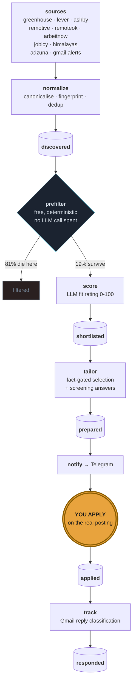

<div align="center">

# jobpipe

**A job-search pipeline that automates everything except the submit button.**

Discovery, deduplication, fit scoring, resume tailoring, screening answers and
reply tracking all run unattended.
You apply, on the employer's own site, from a queue of fifteen.

[](https://github.com/Asit0007/JobPipe/actions/workflows/tests.yml)
[](https://www.python.org/)
[](LICENSE)
[](#cost)

</div>

---

## The one rule

> **Nothing in this codebase submits an application, logs into a job board,
> drives a browser session, or stores a job-board password.**

That is a deliberate design constraint, not an unfinished feature.

Tools that drive your logged-in LinkedIn or Naukri session are the ones that get
accounts restricted — verification email, then outreach disabled for weeks, then
sometimes a lockout that never gets reversed. The asymmetry is the whole
argument: losing your LinkedIn account mid-search is the worst outcome
available, and auto-submit buys throughput on Easy Apply, the lowest-conversion
channel there is.

jobpipe works one layer down, on the **postings**. Public ATS APIs, an
aggregator, and job-alert emails **you** configured, read out of **your own**
inbox. There is no activity on any job board, so there is nothing to detect and
nothing to ban.

`review_api.py` is the only module that can write `status = applied`, and only
in response to you clicking a button after you have already submitted.

<sub>CI enforces this: a workflow fails the build if `selenium`, `playwright`,
`puppeteer` or a board credential ever appears in the source tree.</sub>

---

## How it works



### The funnel is the product

Measured end to end against 45 ATS boards, five public feeds and Adzuna:

| stage | count | |
|---|---:|---|
| ingested | **5,873** | 9 sources, deduplicated |
| killed on keywords | −2,102 | fewer than 2 must-haves present |
| killed on title | −1,926 | sales roles whose JD lists your whole toolchain |
| killed on hard rejects | −421 | seniority, shift work, geography |
| **reach an LLM call** | **974** | 17% — *this is what protects the free tier* |
| shortlisted | **28** | above `shortlist_min_score` |
| **queued for you** | 15/day cap | because volume is not the goal |

Every row killed above the LLM line costs nothing, and that is the whole design.
The free tier allows **500 requests per day per model**, so a single unfiltered
run would exhaust the day before it finished. The prefilter is what makes the
pipeline fit inside a free quota at all.

> **Calibrate `shortlist_min_score` against your own model's output, not a
> guess.** The default assumed scores would spread across 0–100. In practice
> the observed range was 0–85 with a mean of 21, so a threshold of 68 sat above
> almost everything and shortlisted nothing — silently, with no error. Score
> a few hundred rows first, look at the distribution, then set the threshold.
> Re-bucketing is free: scores are stored, so changing it costs no LLM calls.

---

## The facts gate

An LLM asked to "tailor my resume to this JD" will quietly invent metrics, team
sizes and durations. Those become interview questions you cannot answer.

jobpipe makes that **structurally impossible** rather than merely discouraged:

```yaml
# config/facts.yaml — the only source of resume claims
- {id: F005, verified: false, tags: [ansible, automation],
   text: "Wrote Ansible playbooks to replace manual configuration steps"}
```

The tailoring model never writes experience. It receives a **menu of fact IDs**
and must return a *selection*. `tailor.py` validates every ID that comes back
and drops anything it doesn't recognise.

Facts ship `verified: false` and are excluded from the menu entirely until you
flip them. The bar is one question:

> *Could you defend this line if an interviewer stopped you on it?*

That friction is the feature. `facts.yaml` is also schema-validated on load — a
typo'd ID or a missing `verified` key fails loudly instead of silently dropping
the fact.

### Questions it refuses to answer for you

Notice period, current CTC, expected CTC, relocation, reason for leaving.

These are negotiating positions, not form fields. They surface as a reminder on
every prepared application, and you fill them in yourself. See `HUMAN_ONLY` in
`screening.py`.

---

## Setup

Everything is free tier. No card, anywhere.

### 1. Install

```bash
git clone https://github.com/Asit0007/JobPipe.git jobpipe && cd jobpipe
python3 -m venv .venv && source .venv/bin/activate
make install
make config          # creates .env + your private config from the templates
```

`config/profile.yaml` and `config/facts.yaml` are gitignored — they hold your
work history and your salary target.

### 2. Gemini key, then let the doctor tell you the rest

Paste your key into `.env` as `GEMINI_API_KEY`, then:

```bash
make doctor
```

It reports your tier, lists the models your key can *actually* call, and prints
the exact `MODEL_SCORE` / `MODEL_TAILOR` / `GEMINI_RPM` block to paste back into
`.env`. Re-run it until every check is green.

> On the free tier Google may train on your prompts. `llm.py` strips emails,
> phone numbers, ID numbers and profile URLs from every prompt before it leaves
> the process. Add your employer's name to `PII_DENY_TERMS` in `.env`.

### 3. Fill in the two files that matter

**`config/profile.yaml`** — titles, locations, thresholds, and the three reject
lists. Tune `title_reject` and `hard_reject` aggressively; every term you add
saves quota for free.

**`config/facts.yaml`** — see [the facts gate](#the-facts-gate). Nothing can be
prepared until at least one fact is verified. `make doctor` tells you the count.

### 4. Wire the sources

```bash
make verify          # pings every ATS slug, prints the dead ones
```

Prune whatever comes back `DEAD`, then add companies you actually want. Open a
careers page and read the URL:

| URL | put the slug under |
|---|---|
| `boards.greenhouse.io/SLUG` | `greenhouse:` |
| `jobs.lever.co/SLUG` | `lever:` |
| `jobs.ashbyhq.com/SLUG` | `ashby:` |

<details>
<summary><b>Five public feeds</b> — already on, nothing to configure</summary>

Remotive, RemoteOK, Arbeitnow, Jobicy and Himalayas are global feeds rather
than company boards: no key, no slug, nothing in `companies.yaml`. They run on
every `make ingest` and contribute ~410 rows.

They are remote- and Western-skewed, so treat them as widening the funnel
rather than as a primary source. Measured on one run, Jobicy had the best hit
rate and RemoteOK returned nothing usable at all — the postings were genuinely
off-target ("Gardener", "Equipment Maintenance"), not a broken adapter. It is
kept anyway, because the prefilter discards a bad feed for free. **Adding a
weak feed costs ingest time, never quota.**
</details>

<details>
<summary><b>Adzuna</b> — optional, 1000 free calls/month, covers the India market</summary>

Register at [developer.adzuna.com](https://developer.adzuna.com), put the app id
and key in `.env`.

One call per entry in `targets.titles`, so 23 titles is 23 of your 1000 monthly
calls per run — fine daily, worth counting before you add more. Descriptions are
truncated to ~500 characters and **that is permanent**: the API hands back an
`adzuna.*/land/ad/…` redirect page rather than the employer's URL, and that page
refuses a plain GET, so `jdfetch` cannot enrich them. Scores are weighted down
to compensate.

If you are searching in India, this is the source that matters — 96% of its rows
came back India-located, against a handful from the ATS boards.
</details>

<details>
<summary><b>Gmail</b> — optional, and the only way LinkedIn and Naukri get in</summary>

Google moved this. The old "APIs & Services → OAuth consent screen" path no
longer exists; consent now lives under **Google Auth Platform**.

1. **Enable the API** — [console.cloud.google.com/apis/enableflow;apiid=gmail.googleapis.com](https://console.cloud.google.com/apis/enableflow;apiid=gmail.googleapis.com)
   → pick or create a project → **Enable**. (Nothing else on this list is
   reachable until the API is enabled, which is why it comes first.)
2. **Branding** — [console.cloud.google.com/auth/branding](https://console.cloud.google.com/auth/branding)
   → app name, your own address as support email and contact → Create.
3. **Audience** — [console.cloud.google.com/auth/audience](https://console.cloud.google.com/auth/audience)
   → **External**. *Internal* only appears for Google Workspace organisations,
   so a personal `@gmail.com` account cannot pick it.
4. **Publish it.** On that same Audience page, press **Publish app** to move it
   out of *Testing*. **In Testing, refresh tokens expire after 7 days** — the
   daily cron would silently stop ingesting alerts every week. Publishing an
   unverified app is fine here: you are the only user, and consent shows a
   "Google hasn't verified this app" screen you clear once via
   **Advanced → Go to … (unsafe)**. Verification is only needed to hand the app
   to strangers.
5. **Clients** — [console.cloud.google.com/auth/clients](https://console.cloud.google.com/auth/clients)
   → Create client → **Desktop app** → Create → download the JSON.
6. Save it as `data/gmail_credentials.json`
7. `make gmail-auth PY=./.venv/bin/python` — one browser consent, then it
   confirms which mailbox it authorised.
8. Set up saved-search alerts on Naukri, LinkedIn, Indeed or Glassdoor, daily
   email. **Naukri first** — see below.

The scope is **read-only**. You configure the searches on their site; they email
you; jobpipe reads your own inbox. Zero account activity on any platform.

**Set up Naukri first.** Its postings can be fetched, so those rows get a full
job description. LinkedIn, Indeed and Glassdoor cannot — LinkedIn's robots.txt
disallows `/jobs/view/`, and the other two serve a login wall to a plain GET.
Those rows keep whatever blurb the email carried and nothing more, so the
keyword prefilter stands aside for them rather than killing a row for having a
title it could not read.
</details>

<details>
<summary><b>Telegram</b> — optional, for the daily queue</summary>

1. [@BotFather](https://t.me/botfather) → `/newbot` → token into `.env` as
   `TELEGRAM_BOT_TOKEN`
2. **Send your new bot a message** (`/start`). A bot cannot message you until
   you have messaged it first, so this step is not optional.
3. `make telegram-check PY=./.venv/bin/python` — validates the token and prints
   your chat id from `getUpdates`, so you do not need a third-party bot for it.
4. Put it in `TELEGRAM_CHAT_ID`, re-run, and it sends a real test message.

Without a chat id the queue just prints to stdout. Note that an **empty** value
in `.env` reads as "configured" to a careless grep — check the value, not the
key.
</details>

### 5. Run it

```bash
make ingest      # pull every source, normalize, dedup
make score       # free prefilter, then LLM on the survivors
make prepare     # tailored bullets + screening answers
make notify      # push the day's shortlist to Telegram
make review      # dashboard on 127.0.0.1:8080
```

Or `make all`. `make status` shows pipeline counts and remaining quota.

---

## The daily loop

Telegram pings you at 07:00 with up to fifteen roles. Each shows the fit score,
the deciding reason, your genuine skill gaps, and a link.

Open `make review`, expand the prepared bullets and screening answers, apply on
the company's site, click **Mark applied**.

**Budget 45 minutes.** Fifteen tailored applications beat two hundred blind ones
— and the applying is the part no pipeline can do for you.

> **One thing this tool cannot do.** Referrals convert roughly 10–20× better
> than cold applications, and jobpipe is deliberately optimising the
> second-best channel. Don't let a wall of green checkmarks substitute for
> messaging someone who works there.

---

## Deployment

**Recommended — an always-free Oracle Cloud ARM box:**

```bash
rsync -av --exclude .venv --exclude data --exclude .git ./ ubuntu@<ip>:~/jobpipe/
ssh ubuntu@<ip> 'cd ~/jobpipe && bash deploy/oci-setup.sh'
```

The dashboard binds to `127.0.0.1` only. Reach it through a Cloudflare Tunnel
behind Cloudflare Access — no open ports, no ingress rule. `deploy/crontab`
drives the schedule via supercronic, so runs happen at 07:00 IST and stay there.

**Fallback — GitHub Actions.** `.github/workflows/pipeline.yml` runs weekdays at
07:00 IST. It works, with one real caveat: runners are ephemeral, so the SQLite
file that *is* the dedup layer rides in the Actions cache. On a cache miss every
posting looks new. Fine as a backup, wrong as a home.

**Not Vercel.** Rate-limited scoring of 100 jobs takes 8–10 minutes against a
~60s function ceiling, and the SQLite file would reset on every invocation.
See [`deploy/VERCEL.md`](deploy/VERCEL.md).

---

## Cost

| | |
|---|---|
| Gemini | free tier — **500 requests/day per model**, 10 RPM |
| ATS APIs | public, no key, no quota |
| Adzuna | free tier, 1000 calls/month |
| Gmail API | free, read-only scope |
| Telegram | free |
| Hosting | OCI always-free ARM |
| **total** | **$0** |

A daily budget counter persists to disk behind a file lock, so a runaway retry
loop can't burn the quota at 3am and leave you with nothing at 9am. The rate
limiter and the counter are shared across processes — the scheduler and a manual
run can overlap without doubling your real request rate.

Two things about that quota are easy to get wrong, and both were learned the
expensive way:

- **It is per model, not per project.** `MODEL_SCORE` and `MODEL_TAILOR` each
  get their own 500/day, so the counter tracks them separately. A single shared
  counter meant a long `score` run locked out `prepare` for no reason.
- **It resets at midnight America/Los_Angeles**, whatever your timezone. In IST
  that is 12:30 — the middle of the working day. A run at 11:00 is on the
  previous quota day and may have nothing left; 13:00 is a fresh 500. The
  counter rolls on the Pacific date so it agrees with Google rather than with
  your laptop.

**Only ever point `MODEL_*` at a `-latest` alias.** A pinned version such as
`gemini-3.6-flash` reports a free-tier quota of **20 requests a day** — enough
for six prepared applications. The aliases are the only names carrying the full
free quota.

---

## What it deliberately will not do

- Submit an application anywhere
- Store a LinkedIn, Naukri or Indeed password
- Drive a logged-in browser session on any job board
- Answer notice period, CTC or relocation questions on your behalf
- Use an unverified fact, or a fact ID the model invented

---

## Layout

```
config/profile.yaml       search definition, three reject lists, thresholds
config/facts.yaml         the verified-fact menu — the anti-hallucination boundary
config/companies.yaml     ATS slugs (the part you maintain by hand)
scripts/doctor.py         preflight: key, tier, models, config, integrations

src/jobpipe/
  llm.py                  Gemini over raw REST — rate limit, budget, PII redaction
  sources/                greenhouse · lever · ashby · adzuna · gmail alerts
                          remotive · remoteok · arbeitnow · jobicy · himalayas
  normalize.py            canonicalisation, fingerprinting, fuzzy dedup
  jdfetch.py              descriptions for postings that arrive without one
  score.py                free prefilter → LLM scoring
  tailor.py               fact-bounded tailoring + the validation gate
  screening.py            screening answers; human-only questions carved out
  notify.py               Telegram review queue
  track.py                reply classification + follow-up nudges
  review_api.py           dashboard; the sole writer of status=applied

deploy/                   OCI setup, crontab, cloudflared example
```

**Stack** — Python 3.12 · SQLite · httpx · FastAPI · Gemini (raw REST) ·
rapidfuzz · Docker Compose · Cloudflare Tunnel

```bash
make test          # 91 tests
```

---

<div align="center">
<sub>Built for one job search. The submit button stays human.</sub>
</div>
